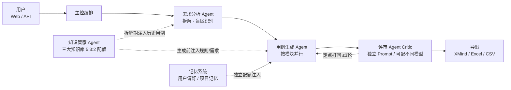

# TianGong · AI 测试用例生成平台（TestCase Agent）

输入需求文档（PDF / Word / 图片 / 文本），多 Agent 协作自动完成**测试点拆解 → 用例生成 → 独立评审**，输出 XMind 脑图与 Excel/CSV 测试用例，支持对话式多轮修订与评审闭环留痕。

> 目标：将测试用例设计从"逐条手写"升级为"系统生成 + 人工评审"，沉淀团队知识资产，用例产出提效 50% 以上。

## 核心能力

| 能力 | 说明 |
|---|---|
| 多格式需求接入 | PDF / Word / 图片 / 纯文本混合上传；图片与文档内嵌图经 Vision 模型多模态理解；解析结果可预览修正；超长文档自动分片并行处理 |
| 多 Agent 流水线 | 需求分析（测试点拆解 + 需求盲区识别）→ 用例生成（多模块并行）→ **独立评审 Critic**：不合格项带具体问题定点打回，≤3 轮回环，超限强制出稿并标注未通过项 |
| 测试点确认 | 可选"先拆解、人工确认测试点后再生成"，拆解结果可编辑 |
| 用例模板 | 内置默认模板；上传 Excel/CSV/XMind 自动识别自定义模板（字段映射可调整），生成时按模板校验字段与优先级枚举 |
| 知识库 RAG | 测试用例库 / 需求文档库 / 玩法与业务规则库三类知识，向量 + 关键词混合检索；知识管家 Agent 按 5:3:2 配额、分阶段差异化注入；每次任务记录知识快照支撑归因 |
| 长期记忆 | 用户偏好与项目记忆跨会话保留，独立配额注入生成上下文；常用模板/模型与重复修订要求自动沉淀为偏好；记忆可查看、编辑、删除 |
| 多轮对话修订 | 对生成结果提修订要求，增量定点修正（只改受影响用例，其余原样保留），修订历史留痕 |
| 评审闭环双通道 | 在线：逐条采纳/修改/删除 + 反馈留痕，按终稿重导出；离线：人工定稿文件回传，自动计算字段级差异与采纳率 |
| 多模型接入 | 配置化多厂商接入（当前：DeepSeek 商用 API + 内网 Ollama 私有化 Vision/Embedding），OpenAI 兼容协议，自动重试与降级，新增模型只改配置 |
| 使用形态 | Web 界面 + REST API；任务异步执行、进度轮询、历史任务管理 |

## 系统架构



- 编排采用 LangGraph 有向图，生成与评审强制分离；上下文按 Agent 职责隔离（历史用例只进拆解与评审，不进生成）。
- 每次任务记录完整 Agent 调用链路、知识快照与记忆快照，为后续效果归因与自动调优积累数据。

## 快速开始

环境要求：Python 3.12。

```bash
# 1. 安装依赖
python3.12 -m venv .venv && source .venv/bin/activate
pip install -e ".[dev]"

# 2. 配置密钥（不入库）
echo 'DEEPSEEK_API_KEY=sk-xxxx' > .env
# 模型清单见 config/models.yaml，新增厂商/私有化模型只需追加条目

# 3. 启动服务（自动拉起本地 MySQL，再启动 uvicorn；参数透传 uvicorn）
bash scripts/dev.sh

# 4. 打开 Web 界面
open http://localhost:8000/
```

运行测试：`pytest`（222 项，LLM 调用以桩件隔离，无需网络）。

### 品牌资源

吉祥物「夜枭」（戴扫描护目镜的机械猫头鹰）：`app/web/brand/` 下有 `owl.svg`（应用图标 / favicon）、`owl-idle / owl-generating / owl-pass / owl-fail.svg`（四种表情）、`owl-mono.svg`（单色，随 currentColor）、`lockup.svg`（横版组合），运行时经 `/brand/*` 访问。

### 部署须知

- **单进程运行**：用户/项目/任务等为进程内内存态 + 数据库回写，`uvicorn` 不要加 `--workers`；启动时会在 `outputs/.instance.lock` 加文件锁，第二个实例会直接拒绝启动。
- **初始管理员**：未配置 `TIANGONG_ADMIN_PASSWORD` 时首启生成随机口令打印在日志（仅一次），首次登录强制改密。
- **反向代理**：配置 `TIANGONG_TRUSTED_PROXIES=代理IP` 后才采信 `X-Forwarded-For`，否则审计 IP 取直连地址。
- **OpenAPI 文档**默认关闭（`TIANGONG_EXPOSE_DOCS=true` 开启）；登录接口有失败锁定（5 次 / 15 分钟）。
- **模型密钥**只能通过形如 `XXX_API_KEY` 的环境变量引用，配置样例见 `.env.example`。
- 上传限制：单文件 `TIANGONG_MAX_UPLOAD_SIZE_MB`（默认 50）、执行附件 200MB、PDF 300 页、zip 类文档解压后 300MB。
- 日志留存：AI 调用日志与操作日志默认保留 180 天（`TIANGONG_LOG_RETENTION_DAYS`）。

## 演示路径（约 10 分钟）

1. **创建任务**：Web 界面上传需求文档（可混合粘贴文本），填写项目名，勾选"先确认测试点"。
2. **拆解确认**：查看模块化测试点与**需求盲区提示**（需求含糊处自动标出），可编辑后确认生成。
3. **查看结果**：用例按模块/优先级组织，显示评审轮次与是否通过；下载 XMind/Excel/CSV。
4. **在线评审**：逐条采纳/修改/删除并填写反馈，提交后自动重排编号并重导出（留痕可查）。
5. **对话修订**：输入如"补充断线重连场景，相关用例优先级调整为 P0"，增量更新结果。
6. **终稿回传**：把线下修改后的 Excel 上传，自动展示新增/删除/修改差异与采纳率。
7. **记忆**：左侧记忆面板查看自动沉淀的偏好；任务详情可见本次生成引用了哪些记忆。

内部真实需求实测（3 页玩法文档）：产出 63 条用例、5 个功能模块，评审 1 轮通过，自动识别 10 条需求盲区；单次修订增量更新约 13 秒完成。

## 主要接口

| 方法 | 路径 | 说明 |
|---|---|---|
| POST | `/api/v1/tasks` | 创建生成任务（文件/文本，支持异步与拆解确认） |
| POST | `/api/v1/tasks/{id}/confirm` | 确认测试点，继续生成 |
| POST | `/api/v1/tasks/{id}/revise` | 对话式多轮修订 |
| POST | `/api/v1/tasks/{id}/review` | 在线评审：逐条采纳/修改/删除留痕 |
| POST | `/api/v1/tasks/{id}/final` | 离线终稿回传，计算差异与采纳率 |
| GET | `/api/v1/tasks` | 任务列表与进度轮询 |
| POST | `/api/v1/knowledge/docs` / `cases` | 知识文档入库 / 历史用例导入 |
| GET/POST | `/api/v1/memories` | 记忆查看与维护 |
| POST | `/api/v1/templates` | 上传并识别自定义模板 |
| GET/POST/PUT/DELETE | `/api/v1/projects[/{name}]` | 项目实体（编码/负责人/状态/归档）、收藏 `/favorite` |
| GET/PUT/DELETE | `/api/v1/projects/{name}/members[/{user}]` | 项目成员与项目角色 |
| GET/POST/PUT/DELETE | `/api/v1/projects/{name}/versions[/{id}]` | 项目版本 |
| GET/POST/PUT/DELETE | `/api/v1/projects/{name}/modules[/{id}]` | 模块树（≤5 级，逻辑删除/恢复/排序/移动） |
| GET/PUT | `/api/v1/auth/me` | 当前用户（含所属项目角色、收藏/最近访问）/ 自助资料 |
| GET/POST/PUT/DELETE | `/api/v1/requirements[/{id}]` | 需求中心：需求实体（原文/附件/人工补充/状态），详情含追溯与覆盖识别 |
| POST | `/api/v1/requirements/{id}/analyze` | AI 需求分析（11 项结构化输出，待确认事项进入确认流） |
| POST | `/api/v1/requirements/{id}/questions[/{qid}]` | 待确认事项：人工补充 / 确认结论 / 重新打开 |
| POST | `/api/v1/requirements/{id}/design` | 从需求发起测试设计（任务回挂需求/模块/版本；未确认事项未清则 409） |
| GET | `/api/v1/ai/tasks` / `/ai/calls[/{id}]` / `/ai/stats` | AI 任务中心、调用日志（用途/模型/Prompt 版本/输入输出/发起人）、用量统计 |
| GET/POST | `/api/v1/ai/prompts[/{key}/versions[/{n}/activate\|archive]]` | Prompt 版本化管理（管理员） |
| POST | `/api/v1/tasks/{id}/retry` | 失败任务重试 |
| GET | `/api/v1/audit` | 操作日志 / 系统安全日志（管理员看全部，成员看所属项目与自己） |
| GET | `/api/v1/workbench` / `/search?q=` / `/projects/{name}/coverage` | 我的工作台、全局搜索、覆盖追溯视图 |
| POST | `/api/v1/knowledge/docs` | 知识入库：level=public/project/module + project + module |

完整接口文档见服务启动后的 `/docs`（OpenAPI）。

## 项目结构

```
app/
├── agents/      # LangGraph 编排：拆解 → 生成 → 评审回环，Prompt 体系
├── llm/         # 多厂商模型适配层：注册表 + 客户端，重试与降级，Vision 路由
├── parsers/     # PDF/Word/图片/文本解析，大文档分片，图文混排理解
├── knowledge/   # 三大知识库：入库、混合检索、知识管家（配额与快照）
├── memory/      # 长期记忆：用户偏好/项目记忆、使用习惯沉淀、检索注入
├── templates/   # 内置模板 + 自定义模板识别与模板库
├── exporters/   # XMind（ZEN 格式）/ Excel / CSV 导出
├── tasks/       # 任务存储、异步执行、终稿差异计算
├── api/         # REST 接口
└── web/         # Web 界面（单页）
config/models.yaml   # 模型清单（密钥走 .env）
docs/                # 需求文档、排期计划、架构图
scripts/             # dev.sh 一键启动、mysql_dev.sh 本地库、评测脚本
tests/               # 121 项测试（LLM 桩件隔离）
```

## 里程碑进度

V1.0 排期见 `docs/AI测试用例管理平台_V1.0_排期.md`（按需求 25 章对齐，验收 2026-11-06）。

| 里程碑 | 内容 | 状态 |
|---|---|---|
| 生成质量闭环（原 M1–M4） | 多 Agent 编排、拆解确认、评审闭环、知识库 RAG、Web 界面、长期记忆 | ✅ 已完成 |
| M3 评审深化与版本安全 | 结构化驳回、字段/步骤级定位、AI 修改确认流、版本历史、乐观锁、回收站 | ✅ 已完成 |
| M4 测试计划与执行 | 计划实体、用例快照、任务分配、执行挂计划、执行附件 | ✅ 已完成 |
| M1 平台底座与权限 | 用户资料/禁用、系统级与项目级角色分离、项目成员、接口级项目隔离、项目字段与收藏/最近访问、版本与模块树、页面结构对齐 | ✅ 已完成 |
| M2 需求中心与追溯链 | 需求实体化（原文永久保留、附件逐文件解析失败显式提示、人工补充独立保存）、AI 需求分析 11 项输出、待确认事项确认后才能测试设计、需求→测试点→用例→计划→执行追溯与覆盖识别、存量任务自动迁移为需求 | ✅ 已完成 |
| M5 AI 中心、统计与审计 | 全部 Prompt 版本化（草稿/激活/回滚）、AI 调用日志与任务 Prompt 版本留痕、AI 任务中心（失败重试、部分成功明示）、知识库公共/项目/模块三层与跨项目隔离、AI 质量五指标、操作日志与系统安全日志、我的工作台、全局搜索、覆盖追溯视图 | ✅ 已完成 |
| M4b 用例导入与批量维护 | Excel 导入五步校验、人工新增/复制、批量补齐 | 排期 10 月底 |

### 权限模型（M1）

- 系统级角色 `admin` / `member` 与项目级角色分离：项目管理员 / 测试负责人 / 测试人员 / 只读人员（`app/permissions.py` 权限矩阵）。
- 所有业务接口按「所属项目 + 动作」校验；未加入项目的用户对该项目数据一律不可见（403），杜绝跨项目 ID 访问。
- 系统管理员视同任一项目的项目管理员；项目创建/删除仅系统管理员。
- 历史遗留「未指定项目」的任务仅系统管理员可见（M2 需求实体化时迁移归属）。
- 已归档项目只读，恢复后才能修改。

试点计划：10 月中旬起 6 周，游戏 + 非游戏各一条业务线试运行，目标用例采纳率 ≥50%，扩大期 ≥70%。
